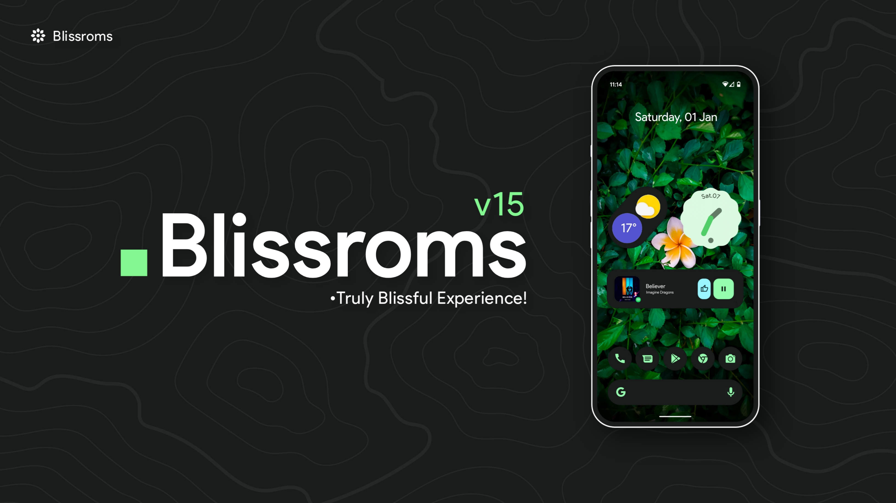

# Welcome to BlissRoms

[BlissRoms](https://blissroms.org/) is an open-source operating system based on Android with customizations, options and added security features. Our prime aim is to provide a blissful experience to our users.

---

## BlissRoms Important Links

- [x] [Website](https://blissroms.org)
- [x] [Downloads](https://downloads.blissroms.org)
- [x] [Twitter](https://twitter.com/Bliss_ROMs)
- [x] [Instagram](https://www.instagram.com/blissroms)
- [x] [Telegram](https://t.me/BlissROM_Updates)
- [x] [Reddit](https://www.reddit.com/r/BlissRoms)
- [x] [Github](https://github.com/BlissRoms)
- [x] [Gerrit Code Review](https://review.blissroms.org)
- [x] [Help us to Translate](https://translate.blissroms.org)