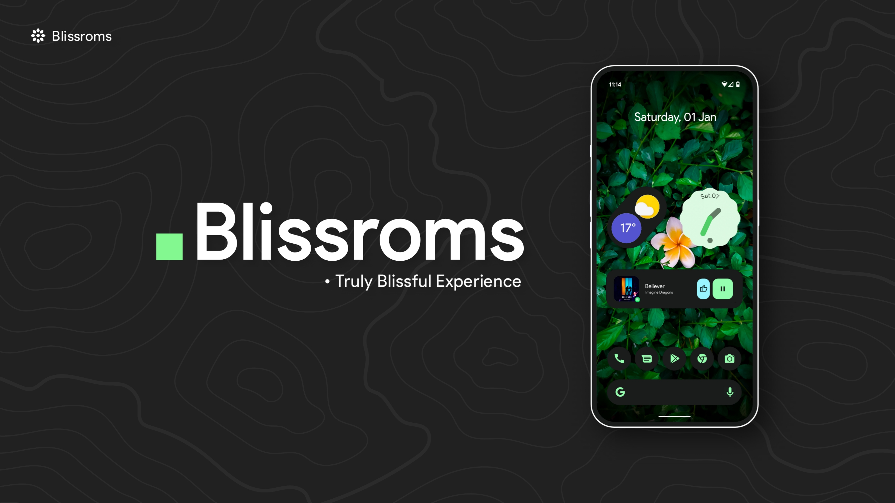

# Welcome to BlissRoms

[BlissRoms](https://blissroms.org/), an open-source operating system built upon Android Open Source Project, that offers a harmonious blend of customization, options, and security features. With a commitment to delivering pure bliss in every build, it brings with it a world of limitless possibilities.

---

## BlissRoms Important Links

- [Website](https://blissroms.org)
- [Downloads](https://downloads.blissroms.org)
- [Documentation](https://docs.blissroms.org)
- [Twitter](https://twitter.com/Bliss_ROMs)
- [Instagram](https://www.instagram.com/blissroms)
- [Telegram](https://t.me/BlissROM_Updates)
- [Reddit](https://www.reddit.com/r/BlissRoms)
- [Source](https://github.com/BlissRoms)
- [Device Source](https://github.com/BlissRoms-Devices)
- [Gerrit Code Review](https://review.blissroms.org)
- [Help us to Translate](https://translate.blissroms.org)
